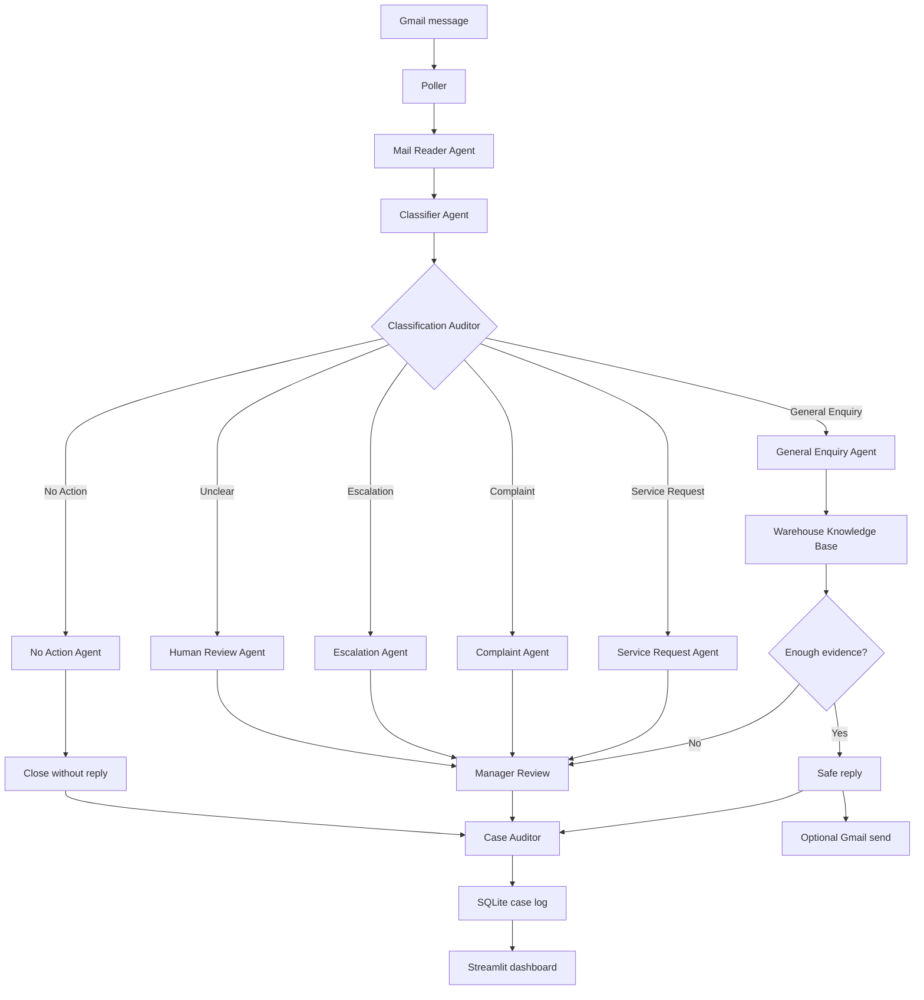

# Inbox AI

Inbox AI is a warehouse mailbox assistant. It reads incoming Gmail messages, classifies the request, routes it through a LangGraph agent workflow, and shows the result in a Streamlit dashboard.

The demo is designed to show how an operations mailbox can move from manual email triage to an AI-assisted queue with clear routing, audit trail, and safe reply handling.

## Demo

Hosted demo:

```text
https://inboxai.devcrew.dev/
```

To test it, send a warehouse-style email to:

```text
navnee4501@gmail.com
```

The assistant will poll the inbox, classify the email, decide the correct workflow path, and log the result in the dashboard.

## What It Does

- Reads Gmail messages through OAuth
- Classifies mail into operational categories
- Routes each case through a LangGraph workflow
- Answers safe general enquiries from a local knowledge base
- Holds unclear or risky cases for manager review
- Suppresses automated, promotional, or no-action emails
- Stores cases, decisions, actions, and audit traces in SQLite
- Shows the queue in a Streamlit dashboard

## Basic Architecture

```text
Gmail
  -> Poller
  -> LangGraph workflow
  -> SQLite
  -> Streamlit dashboard

Optional safe reply
  -> Gmail send
```

Runtime services:

- `api`: FastAPI backend for health checks, Gmail polling, OAuth callback, and case APIs
- `dashboard`: Streamlit UI for the demo dashboard
- `poller`: background worker that checks Gmail automatically
- `data/`: private runtime database, logs, and Gmail token
- `secrets/`: private OAuth client JSON

## Agent Workflow



Supported branches:

- `General Enquiry`: answers from the knowledge base only when evidence is strong
- `Service Request`: extracts operational details and prepares routing
- `Complaint`: prepares manager-facing review actions
- `Escalation`: flags urgent warehouse issues for human attention
- `No Action`: closes newsletters, receipts, automated alerts, and unrelated mail
- `Unknown`: sends unclear cases to human review

## Safety Behavior

Inbox AI does not blindly answer every email.

- If the knowledge base cannot answer a General Enquiry, the case goes to human review.
- Complaint, Escalation, Unknown, and Needs Human cases are not auto-sent.
- No Action emails are logged and closed without a reply.
- Every case keeps an agent trace so the decision can be inspected.

## Run Locally

The app runs with Docker Compose:

```bash
docker compose up --build -d
```

Open:

```text
Dashboard: http://localhost:8502
API:       http://localhost:8501
```

Private runtime files are intentionally not committed:

- `.env`
- `data/`
- `secrets/`

## Deployment Shape

For the hosted demo, Docker Compose runs the API, dashboard, and poller on the server. Nginx exposes the public HTTPS domain:

```text
https://inboxai.devcrew.dev/       -> Streamlit dashboard
https://inboxai.devcrew.dev/api/*  -> FastAPI backend
```

The Nginx site config lives at:

```text
deploy/nginx/inboxai.devcrew.dev.conf
```

## Project Layout

```text
app/main.py              FastAPI app
app/dashboard/           Streamlit dashboard
app/common/              Gmail, polling, storage, settings, LLM helpers
app/core/workflow/       LangGraph workflow and branch agents
app/core/knowledge/      Local warehouse knowledge base
deploy/nginx/            Nginx config for hosted demo
tests/                   Workflow, Gmail, UI, LLM, and KB tests
```
