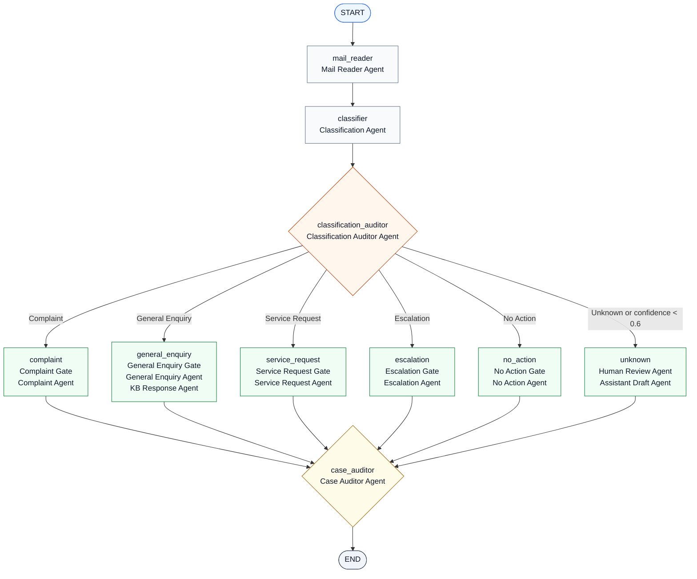
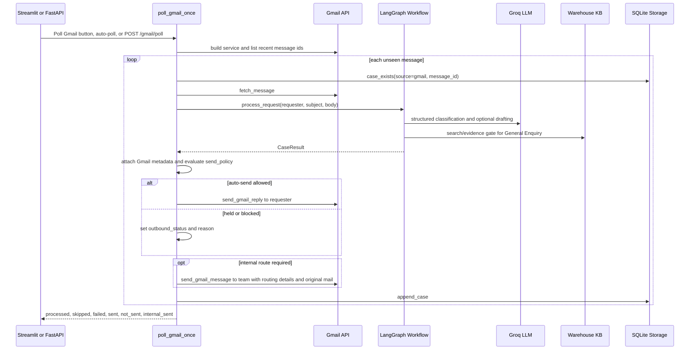
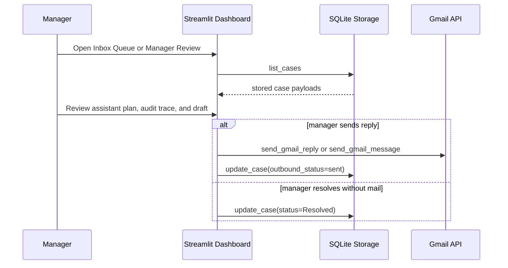

# Inbox AI Architecture

This document is the editable architecture reference for the Inbox AI warehouse mailbox assistant.

## Full Runtime Architecture

```mermaid
flowchart LR
    manager["Warehouse manager / operator"]
    apiClient["API client"]

    subgraph external["External services"]
        gmailInbox["Gmail Inbox"]
        googleOAuth["Google OAuth"]
        gmailAPI["Gmail API"]
        groq["Groq LLM<br/>ChatGroq"]
    end

    subgraph dashboard["Streamlit dashboard<br/>app/dashboard/main.py"]
        topActions["Main actions<br/>Connect Gmail<br/>Poll Gmail"]
        inboxTab["Inbox Queue"]
        reviewTab["Manager Review"]
        repliesTab["Assistant Replies"]
        metricsTab["Metrics"]
        workflowTab["Workflow"]
        setupTab["Setup"]
    end

    subgraph fastapi["FastAPI service<br/>app/main.py"]
        health["GET /health"]
        prodStatus["GET /production/status"]
        casesAPI["GET /cases<br/>GET /cases/{case_id}"]
        pollAPI["POST /gmail/poll"]
        oauthCallback["GET /oauth/gmail/callback"]
    end

    subgraph gmailLayer["Gmail integration<br/>app/common/gmail.py"]
        auth["OAuth and credentials<br/>credentials_configured<br/>gmail_authorization_url<br/>save_oauth_token"]
        readMail["Read mail<br/>list_recent_message_ids<br/>fetch_message<br/>clean_email_body"]
        sendMail["Send mail<br/>send_gmail_reply<br/>send_gmail_message<br/>validate_gmail_send_content"]
    end

    subgraph poller["Polling and send policy<br/>app/common/polling.py"]
        pollOnce["poll_gmail_once"]
        query["effective_gmail_query"]
        duplicateGuard["Duplicate guard<br/>case_exists"]
        processMessage["process_gmail_message"]
        metadata["attach_gmail_metadata"]
        sendPolicy["send_policy<br/>apply_send_policy"]
        pollErrors["record_poll_error<br/>retry_gmail_message"]
    end

    subgraph workflow["LangGraph workflow<br/>app/core/workflow"]
        graphEntry["process_request<br/>build_graph"]
        reader["mail_reader"]
        classifier["classifier<br/>classify_with_llm"]
        classAudit["classification_auditor<br/>uses scan_mail_signals internally"]
        branchNodes["branch nodes<br/>complaint<br/>general_enquiry<br/>service_request<br/>escalation<br/>no_action<br/>unknown"]
        outputAudit["case_auditor"]
        caseResult["CaseResult<br/>classification<br/>actions<br/>outputs<br/>agent_trace<br/>log"]
    end

    subgraph knowledge["Local knowledge and prompts"]
        kb["Warehouse KB<br/>app/core/knowledge/catalog.py"]
        prompts["Prompt templates<br/>app/common/prompts.py"]
        rules["Deterministic rules<br/>app/core/classification/engine.py"]
    end

    subgraph storage["Persistence and observability<br/>app/common/storage.py<br/>app/common/logging.py"]
        sqlite["SQLite WAL<br/>data/app.sqlite3"]
        casesTable["cases table<br/>payload JSON"]
        errorsTable["poll_errors table"]
        tokenFile["Gmail token<br/>data/gmail_token.json"]
        appLog["Rotating log<br/>data/app.log"]
    end

    manager --> dashboard
    apiClient --> fastapi

    dashboard --> topActions
    dashboard --> inboxTab
    dashboard --> reviewTab
    dashboard --> repliesTab
    dashboard --> metricsTab
    dashboard --> workflowTab
    dashboard --> setupTab

    topActions --> auth
    topActions --> pollOnce
    setupTab --> auth
    inboxTab --> casesTable
    reviewTab --> casesTable
    repliesTab --> casesTable
    metricsTab --> casesTable
    workflowTab --> graphEntry

    reviewTab -->|"manual reply"| sendMail
    repliesTab -->|"manual send or inspect draft"| sendMail

    fastapi --> health
    fastapi --> prodStatus
    fastapi --> casesAPI
    fastapi --> pollAPI
    fastapi --> oauthCallback

    prodStatus --> sqlite
    casesAPI --> casesTable
    pollAPI --> pollOnce
    oauthCallback --> auth

    auth --> googleOAuth
    googleOAuth --> auth
    auth --> tokenFile
    auth --> gmailAPI

    pollOnce --> query
    pollOnce --> auth
    pollOnce --> readMail
    readMail --> gmailAPI
    gmailAPI --> gmailInbox
    gmailInbox --> gmailAPI
    readMail --> duplicateGuard
    duplicateGuard --> processMessage
    processMessage --> graphEntry
    processMessage --> metadata
    processMessage --> sendPolicy
    sendPolicy --> sendMail
    sendMail --> gmailAPI
    processMessage --> casesTable
    pollErrors --> errorsTable
    pollOnce --> pollErrors

    graphEntry --> reader
    reader --> classifier
    classifier --> classAudit
    classAudit --> branchNodes
    branchNodes --> outputAudit
    outputAudit --> caseResult

    classAudit --> rules
    classifier --> prompts
    classifier --> groq
    branchNodes --> groq
    branchNodes --> kb
    branchNodes --> prompts

    caseResult --> sendPolicy
    caseResult --> casesTable
    casesTable --> sqlite
    errorsTable --> sqlite

    pollOnce --> appLog
    processMessage --> appLog
    graphEntry --> appLog
    outputAudit --> appLog

    classDef personClass fill:#eef6ff,stroke:#2563eb,color:#0f172a
    classDef externalClass fill:#f8fafc,stroke:#64748b,color:#0f172a
    classDef appClass fill:#ecfeff,stroke:#0891b2,color:#0f172a
    classDef workflowClass fill:#f5f3ff,stroke:#6d28d9,color:#0f172a
    classDef dataClass fill:#fffbeb,stroke:#d97706,color:#0f172a
    classDef aiClass fill:#fdf2f8,stroke:#db2777,color:#0f172a
    classDef knowledgeClass fill:#f0fdf4,stroke:#16a34a,color:#0f172a

    class manager,apiClient personClass
    class gmailInbox,googleOAuth,gmailAPI externalClass
    class topActions,inboxTab,reviewTab,repliesTab,metricsTab,workflowTab,setupTab,health,prodStatus,casesAPI,pollAPI,oauthCallback,auth,readMail,sendMail,pollOnce,query,duplicateGuard,processMessage,metadata,sendPolicy,pollErrors appClass
    class graphEntry,reader,classifier,classAudit,branchNodes,outputAudit,caseResult workflowClass
    class sqlite,casesTable,errorsTable,tokenFile,appLog dataClass
    class groq,prompts aiClass
    class kb,rules knowledgeClass
```

## LangGraph Agent Workflow

## Main Request Flows

### Gmail Polling Flow

### Manager Review Flow

## Storage Model

| Store | Purpose | Key contents |
|---|---|---|
| `data/app.sqlite3` | Primary runtime database | `cases`, `poll_errors` |
| `cases.payload` | Full case record as JSON | `CaseResult`, Gmail metadata, classification, actions, outputs, trace |
| `poll_errors` | Operational polling failures | message id, stage, error, detail, resolved flag |
| `data/gmail_token.json` | OAuth token | Gmail readonly and send scopes |
| `data/app.log` | Structured app logs | polling, workflow, storage, Gmail send events |

## Branch Outcomes

| Branch | Status target | Automation behavior |
|---|---|---|
| `complaint` | `Needs Human` | Draft acknowledgement, escalate to operations lead, set follow-up |
| `general_enquiry` | `Resolved` or `Needs Human` | Answer only when KB evidence is sufficient |
| `service_request` | `Routed` or `Needs Human` | Extract request details, send requester confirmation, forward details to dock planning, set 2-hour SLA |
| `escalation` | `Needs Human` | Pause automation, prepare supervisor alert and urgent acknowledgement |
| `no_action` | `No Action Closed` or `Needs Human` | Suppress outbound response when no-action signal is clear |
| `unknown` | `Needs Human` | Hold automation and prepare a suggested reply |
